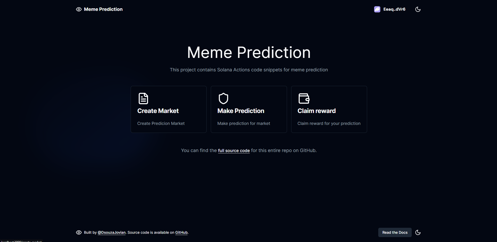

# Solana Meme Coin Prediction Market

## Project Overview

**Project Name:** Solana Meme Coin Prediction Market with Blinks

**Description:** A platform where users can create prediction markets for Solana meme coin prices and participate by predicting if the price will go higher or lower within a specified timeframe.

**Video Link:** [Youtube](https://youtu.be/iDf6b8Z2NHc)

**Demo Link:** [Demo](https://meme-predict.vercel.app/)

**Blink Demo:** [Blink](https://dial.to/?action=solana-action%3Ahttps%3A%2F%2Fmeme-predict.vercel.app%2Fapi%2Factions%2Fmake_prediction%3Fmarket%3D2)

**Smart contract:** [Solscan](https://solscan.io/account/GY8BPUoP7LvyEwGijUqN5tyWmY9zn894x9AHQKzaYocp?cluster=devnet)

## Demo Images

## Table of Contents

1. [Project Overview](#project-overview)
2. [Features](#features)
3. [Architecture](#architecture)
4. [Smart Contract](#smart-contract)
5. [Setup and Installation](#setup-and-installation)
6. [Usage](#usage)
7. [Error Handling](#error-handling)
8. [Testing](#testing)
9. [License](#license)

## Features

### Market Creation

- **Create Market:**
  - Users can create a new prediction market by selecting a meme coin and setting a timeframe.
  - The initial price of the coin is fetched from a price oracle and displayed.
  - Users can set a minimum stake amount for participation.
- **Market Activation:**
  - The created market is listed on the platform for other users to join.

### Prediction Participation

- **Browse Active Markets:**
  - Users can view a list of active markets with details such as meme coin, remaining time, and current predictions.
- **Make a Prediction:**
  - Users can select a market, predict higher or lower, and stake a certain amount of SOL.
  - Users can submit their prediction, which is recorded on the smart contract.

## Architecture

The project is built using Solana and Anchor for smart contract development. The main components include:

- **Smart Contracts:** Written in Rust using the Anchor framework.
- **Frontend:** Provides a user interface for market creation, prediction participation, and viewing results.
- **Backend:** Interacts with Solana blockchain, Blinks and action APIs.

## Smart Contract

### Structure

- **Contexts:**

  - `Initialize`: Initialize the counter for market IDs.
  - `CreateMarket`: Create a new prediction market.
  - `MakePrediction`: Record a user's prediction.
  - `SettleMarket`: Settle the market based on the final price.
  - `ClaimReward`: Claim the reward for a correct prediction.

- **State:**

  - `Counter`: Keeps track of the number of markets created.
  - `Market`: Stores information about each prediction market.
  - `Prediction`: Stores information about each user's prediction.

- **Errors:**
  - Custom error codes for various failure scenarios.

### Smart Contract Code

The smart contract code is available in the `programs/meme-predict` directory. The main program logic is in `src/lib.rs`, and the context, state, and errors are organized in their respective modules.

## Setup and Installation

### Prerequisites

- Rust and Cargo
- Solana CLI
- Anchor CLI
- Node.js and npm (for frontend development)

## License

This project is licensed under the MIT License. See the LICENSE file for details.
